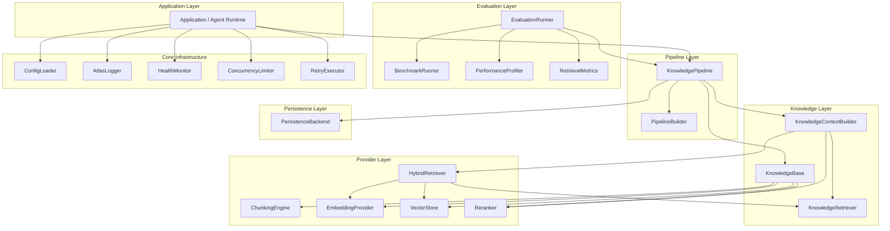
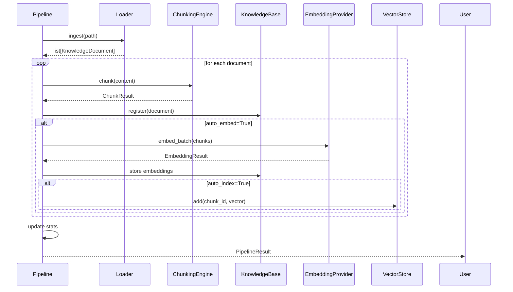
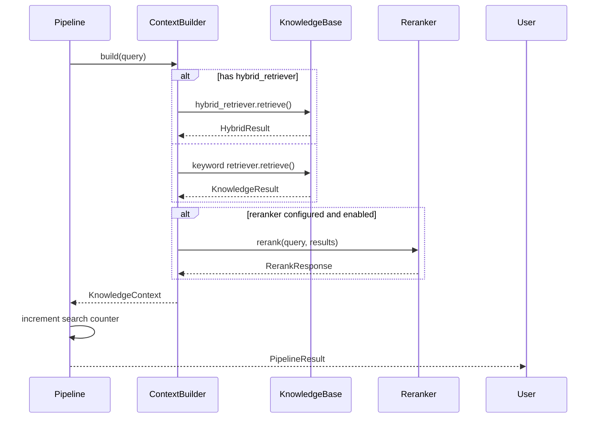
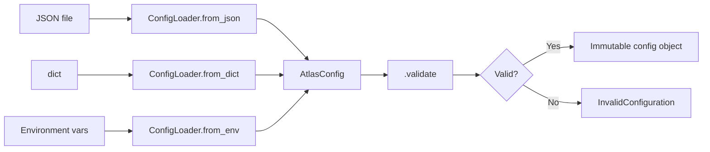

# Architecture

## High-level architecture

Atlas follows a layered architecture with clear separation of concerns:



## Module responsibilities

| Module | Responsibility |
|---|---|
| `app.core.config` | Centralised configuration from dict/JSON/env |
| `app.core.log` | Structured JSON logging to stderr |
| `app.core.health` | Pluggable health check execution |
| `app.core.concurrency` | Async semaphore and resource lifecycle |
| `app.core.reliability` | Exponential backoff retry |
| `app.rag.models` | Shared domain models (documents, chunks, queries) |
| `app.rag.errors` | Shared error hierarchy |
| `app.rag.knowledge_base` | Central document registry with embedding/indexing |
| `app.rag.retriever` | Keyword-based retrieval |
| `app.rag.context` | Context builder merging retrieval + reranking |
| `app.rag.chunking` | Document splitting strategies |
| `app.rag.embeddings` | Vector embedding providers |
| `app.rag.vectorstore` | Vector storage and similarity search |
| `app.rag.hybrid` | Fused keyword + semantic retrieval |
| `app.rag.rerank` | Result reordering |
| `app.rag.pipeline` | End-to-end ingest/search orchestration |
| `app.rag.persistence` | Save/load KB state to durable storage |
| `app.rag.evaluation` | Quality metrics, benchmarking, profiling |

## Design principles

### 1. Frozen dataclasses for all models

Every data type is a `@dataclass(frozen=True)`. This ensures:
- Immutability by default — no accidental mutation
- Hashable when all fields are hashable
- Equality by value, not identity
- Default factory patterns for optional fields

### 2. ABCs for all pluggable interfaces

Every subsystem that supports multiple implementations defines an ABC:

- `EmbeddingProvider`, `VectorStore`, `HybridRetriever`, `Reranker`
- `KnowledgePipeline`, `PersistenceBackend`, `EvaluationRunner`

New implementations subclass the ABC and register with the global registry.

### 3. Global registries for type discovery

Each pluggable subsystem has a global registry mapping `name → class`:

```
embeddings:  register_provider("openai", OpenAIProvider)
rerank:      register_reranker("cross_encoder", CrossEncoderReranker)
pipeline:    register("custom", CustomPipeline)
persistence: register("sqlite", SQLiteBackend)
evaluation:  register("retrieval", RetrievalRunner)
```

Registries store **classes**, not instances. Instantiation happens at the call site.

### 4. No external dependencies for core functionality

Core infrastructure (config, logging, health, concurrency, retry) and the built-in providers (deterministic embeddings, memory vector store, heuristic reranker) use **stdlib only**. External ML models or databases are optional extensions.

### 5. Favor composition over inheritance

The pipeline composes providers rather than inheriting from them:

```
DefaultKnowledgePipeline
    └── has a → ChunkingEngine
    └── has a → KnowledgeBase (which has providers)
    └── has a → KnowledgeContextBuilder (which has retrievers)
```

### 6. Deterministic by default

All serialization uses `sort_keys=True`, `ensure_ascii=False`, and sorted field ordering. This means:
- Same input → same output every time
- Diffable snapshot files
- Reproducible test assertions

### 7. All I/O is async

All potentially blocking operations (embedding, vector search, file I/O, network calls) are `async def`. Synchronous callables are wrapped (e.g. `RetryExecutor` and `PerformanceProfiler` auto-detect and await where needed).

## Ingestion lifecycle



## Search lifecycle



## Error propagation

```mermaid
flowchart TD
    A[Operation] --> B{Success?}
    B -->|Yes| C[Return result]
    B -->|No| D{Error type?}
    D -->|Configuration| E[InvalidConfiguration]
    D -->|Missing resource| F[ResourceNotFound / DocumentNotFound / PipelineNotFound]
    D -->|Provider failure| G[EmbeddingProviderError / FusionError]
    D -->|Validation| H[InvalidPipelineConfiguration / InvalidRetryPolicy]
    D -->|Duplicate| I[DuplicateDocumentError / DuplicateResource]
    E --> J[Wrapped as KnowledgeError or AtlasError]
    F --> J
    G --> J
    H --> J
    I --> J
    J --> K[Caller handles via except / to_dict()]
```

## Configuration flow


