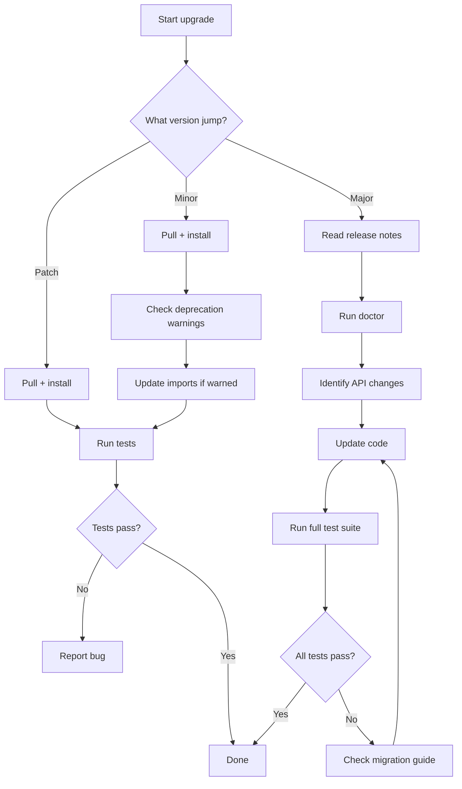

# Migration Guide

## Versioning policy

Atlas follows **Semantic Versioning** (MAJOR.MINOR.PATCH):

| Increment | When | Example |
|---|---|---|
| **MAJOR** | Breaking API changes, removed features | `1.0.0` → `2.0.0` |
| **MINOR** | New features, deprecations, backward-compatible additions | `1.0.0` → `1.1.0` |
| **PATCH** | Bug fixes, performance improvements, documentation | `1.0.0` → `1.0.1` |

## Backward compatibility policy

- Public APIs listed in any `__all__` in any `__init__.py` are considered stable within a MAJOR version.
- Adding a new export to `__all__` is a MINOR change.
- Removing or renaming an export from `__all__` is a MAJOR change.
- Adding new optional parameters to public methods is MINOR; removing parameters is MAJOR.
- New subsystems (new directories under `app/`) are MINOR additions.
- Internal modules (prefixed with `_` or not in `__all__`) have no compatibility guarantees.

## Checking your version

```bash
python tools/atlas_cli.py version
```

## Upgrading between releases

### Patch upgrade (x.y.Z → x.y.Z+1)

```bash
git pull origin main
pip install -e .   # or pip install --upgrade atlas
```

No code changes should be needed.

### Minor upgrade (x.Y.z → x.Y+1.z)

```bash
git pull origin main
pip install -e .
```

Check the deprecation warnings — some APIs may be marked for future removal but remain functional.

### Major upgrade (X.y.z → X+1.0.0)

1. Read the release notes (see `docs/releases/`)
2. Run `python tools/atlas_cli.py doctor` to verify your setup
3. Run your test suite and fix any failures
4. Update imports and API calls per the migration notes below

## Deprecated APIs

| API | Deprecated in | Removed in | Replacement |
|---|---|---|---|
| *(none currently)* | — | — | — |

## Release notes template

Each release includes a file at `docs/releases/v<version>.md` following this template:

```markdown
# Atlas v<version>

Released: YYYY-MM-DD

## Highlights

- Major feature or change summary

## New features

- `module`: description of new capability

## Deprecations

- `module.api()` — use `module.new_api()` instead

## Bug fixes

- `module`: what was fixed

## Migration notes

- Steps required when upgrading to this version
```

## Migration decision tree



## Upgrading patterns

### Import path changes

If a module is reorganised, update imports:

```python
# Old (removed in v2.0)
from app.rag.old_module import OldClass

# New
from app.rag.new_module import NewClass
```

### Configuration format changes

If config fields are renamed between versions, the `ConfigLoader` provides backward-compatible loading for one minor version:

```python
# Old config field (still loads in v1.x, removed in v2.0)
{"log_level": "INFO"}  # → AtlasConfig(log_level="INFO")

# New config field
{"log_level": "INFO"}  # → AtlasConfig(log_level="INFO")
```

### Provider interface changes

Provider ABCs may gain new abstract methods in MINOR releases. If you have custom subclasses:

1. Implement the new method (the ABC will raise `TypeError` at instantiation otherwise)
2. If the method has a default implementation in the base class, override is optional

```python
class MyProvider(EmbeddingProvider):
    # Previously: just embed() and embed_batch()
    # Now also requires: name property
    @property
    def name(self) -> str:
        return "my_provider"
```

## Version compatibility matrix

| Atlas version | Python | Key changes |
|---|---|---|
| 0.1 – 0.6 | 3.12+ | Initial phases (RAG core, chunking, embeddings, vector store, hybrid, rerank) |
| 0.7 | 3.12+ | Pipeline orchestration |
| 0.8 | 3.12+ | Persistence (JSON save/load) |
| 0.9 | 3.12+ | Evaluation framework (metrics, benchmark, profiler, datasets) |
| 1.0 | 3.12+ | Core infrastructure (config, logging, health, concurrency, retry) |
